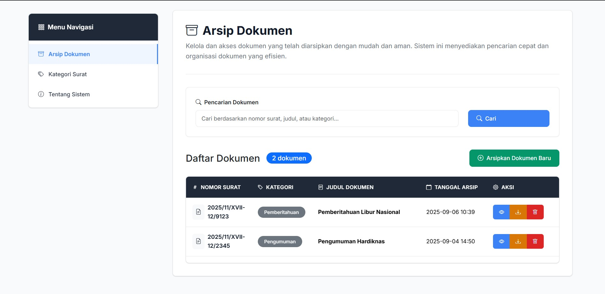

# Aplikasi Arsip Surat

## Tujuan :
Aplikasi Arsip Surat dibuat untuk mempermudah pengelolaan surat masuk/keluar, termasuk penyimpanan, pencarian, pengarsipan, dan pengunduhan file surat dalam format PDF.

## Fitur :
## Manajemen Arsip
- Pencarian Surat  
  Cari surat berdasarkan judul menggunakan search bar.
- Tambah Surat  
  Input data surat baru dengan pilihan kategori (`Undangan`, `Pengumuman`, `Nota Dinas`, `Pemberitahuan`) dan upload file PDF.
- Edit Surat
  Ubah data surat dengan pilihan kategori (`Undangan`, `Pengumuman`, `Nota Dinas`, `Pemberitahuan`) dan upload file PDF.
- Hapus Surat  
  Hapus data surat dengan konfirmasi peringatan terlebih dahulu.
- Unduh Surat  
  Download file surat dalam format PDF ke direktori pengguna.
- Lihat Detail Surat  
  Tampilkan detail surat beserta file PDF.

## Manajemen Kategori Surat  
- Tambah / Edit / Hapus Kategori Surat
  Tambah, edit, dan hapus kategori surat dengan ID otomatis.
- Halaman About  
  Menampilkan foto, nama, NIM, dan tanggal pembuatan aplikasi.

## Cara Menjalankan
1. Clone repository ini:
   ```bash
   git clone https://github.com/chyntiawindyhapsari/arsip_surat.git
   ```
2. Go to the project directory
   ```bash
   cd arsip_surat
   ```
3. Instal Dependensi Laravel
   ```bash
   composer install
   ```
4. Copy .env.example file and rename to .env
   ```bash
   cp .env.example .env
   ```
5. Generate application key
   ```bash
   php artisan key:generate
   ```
6. Create a symlink for static file
   ```bash
   php artisan storage:link
   ```
7. Migrate database
   ```bash
   php artisan migrate
   ```
8. Jalankan Aplikasi
   ```bash
   php artisan serve
   ```

## Dokumentasi
Halaman Utama Arsip

Halaman Tambah Arsip

Halaman Edit Arsip

Halaman Hapus Arsip

Halaman Lihat Arsip

Halaman Utama Kategori Arsip

Halaman Tambah Kategori

Halaman Edit Kategori

Halaman Hapus Kategori

Halaman About

